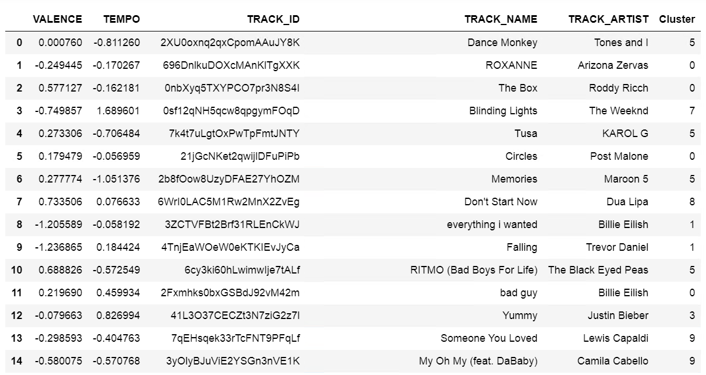
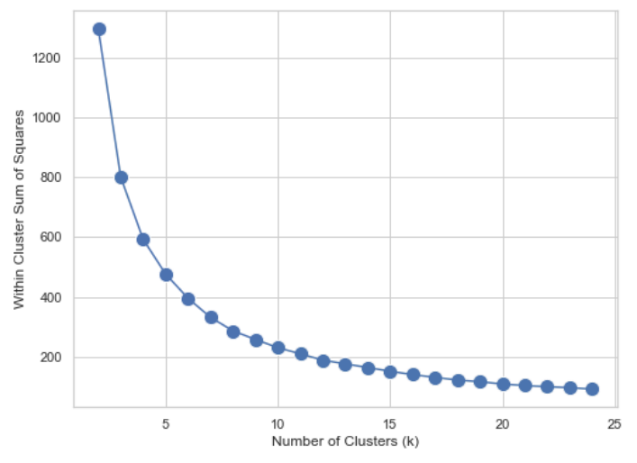

# Can machine learning be used to group Spotify songs based on the audio features valence and tempo?

## Table of Contents
1. [The Dataset](https://github.com/lcar-dsport/clustering_spotify_songs/blob/main/README.md#the-dataset)
2. [Executive Summary](https://github.com/lcar-dsport/clustering_spotify_songs/blob/main/README.md#executive-summary)
3. [Data Preprocessing](https://github.com/lcar-dsport/clustering_spotify_songs/blob/main/README.md#data-preprocessing)
4. [Data Exploration](https://github.com/lcar-dsport/clustering_spotify_songs/blob/main/README.md#4-data-exploration)
5. [Reducing the Dataset](https://github.com/lcar-dsport/clustering_spotify_songs/blob/main/README.md#5-reducing-the-dataset)
6. [Normalizing the Data](https://github.com/lcar-dsport/clustering_spotify_songs/blob/main/README.md#6-normalizing-the-data)
7. [Creating the Initial Clusters](https://github.com/lcar-dsport/clustering_spotify_songs/blob/main/README.md#7-creating-the-initial-clusters)
8. [Evaluating and Visualising the Clusters](https://github.com/lcar-dsport/clustering_spotify_songs/blob/main/README.md#8-evaluating-and-visualising-the-clusters)
9. [Evaluating the Number of Clusters](https://github.com/lcar-dsport/clustering_spotify_songs/blob/main/README.md#9-evaluating-the-number-of-clusters)
10. [Results](https://github.com/lcar-dsport/clustering_spotify_songs/blob/main/README.md#10-results)

## 1. The Dataset
This dataset was obtained from Kaggle at: [Kaggle](https://www.kaggle.com/datasets/joebeachcapital/30000-spotify-songs/data). 
The dataset contains the following columns:
- `TRACK_ID`: Song ID
- `TRACK_NAME`: Song Name
- `TRACK_ARTIST`: Song Artist
- `TRACK_POPULARITY`: Song Popularity With a Rating of 0-100 Where a Higher Rating is Better
- `TRACK_ALBUM_ID`: Album ID
- `TRACK_ALBUM_NAME`: Album Name
- `TRACK_ALBUM_RELEASE_DATE`: Album release date dd/mm/yyyy
- `PLAYLIST_NAME`: Name of spotify playlist
- `PLAYLIST_ID`: Playlist ID
- `PLAYLIST_GENRE`: Playlist Genre
- `PLAYLIST_SUBGENRE`: Playlist Subgenre
- `DANCEABILITY`: How suitable a song is for dancing based on a combination of musical elements including tempo, rhythm stability, beat strength, and overall regularity. A value of 0.0 is least danceable and 1.0 is most danceable.
- `ENERGY`: Energy is a measure from 0.0 to 1.0 and represents a perceptual measure of intensity and activity.
- `KEY`: The estimated overall key of the track. Integers map to pitches using standard Pitch Class notation . E.g. 0 = C, 1 = C♯/D♭, 2 = D, and so on. If no key was detected, the value is -1.
- `LOUDNESS`: The overall loudness of a track in decibels (dB).
- `MODE`: Major is represented by 1 and minor is 0.
- `SPEECHINESS`: Speechiness detects the presence of spoken words in a track. On a scale of 0.0-1.0, where 1.0 represents a track made up of speech only, and where 0.0 represents a track with no spoken word.
- `ACOUSTICNESS`: A confidence measure from 0.0 to 1.0 of whether the track is acoustic. 1.0 represents high confidence the track is acoustic.
- `INSTRUMENTALNESS`: A prediction of whether a track contains vocals. A scale of 0.0-1.0, where 1.0 represents the greater likelihood the track contains no vocal content and is mainly instrumental.
- `LIVENESS`: Detects the presence of an audience in the recording. A scale of 0.0-1.0, where 1.0 represents a strong likelihood of the track being live.
- `VALENCE`: A measure from 0.0 to 1.0 describing the musical positiveness conveyed by a track, where 1.0 means the track is positive and happy.
- `TEMPO`: The tempo of a track in beats per minute (BPM).
- `DURATION_MS`: Duration of a song in milliseconds.

## 2. Executive Summary
Current song recommendation systems are highly personalised to each individual listener. Whilst this approach works, it does not consider any changes in an individual’s music taste as it relies heavily on previous habits. Therefore, an algorithm that accurately recommends songs with similar characteristics without relying too much on previous habits may be more appropriate. This project aimed to investigate whether machine learning can be used to group Spotify songs based on a number of audio features alone without considering listening habits. However, due to time notebook run-time restrictions faced in this project, only two audio features were included in the analysis: valence and tempo. K-means clustering was chosen as the most appropriate machine learning method for this project due to its speed and simplicity when grouping data. Cluster validation techniques revealed that the ideal number of clusters is 20 (k = 20) based on the features chosen and the number of data points. Future iterations should improve on this project by choosing a suitable technique to reduce dimensionality of the dataset and ensure effective outlier removal. Should these improvements be met, an algorithm such as this could be used to develop an audio feature-based song recommendation system.

## 3. Data Preprocessing
### Loading the Data
The file was extracted from Kaggle and loaded into our data warehouse, Exasol. I then connected to the table in Exasol using a connection function in Jupyter Notebooks.

Once the data was loaded into a DataFrame, I conducted an initial visual inspection using the `df.head()` function. This gave me an idea of which columns I wanted to explore further and analyse.

### Data Cleansing
As I was not interested in playlist data, I dropped any playlist columns.

```
df = df.drop(columns = ['PLAYLIST_NAME','PLAYLIST_ID','PLAYLIST_GENRE','PLAYLIST_SUBGENRE']).copy()
```

I knew that some songs may occur in more than one playlist, meaning that the same song could appear multiple times in this dataset. Therefore, I also dropped any duplicate songs.

```
df = df.drop_duplicates().copy()
```

Finally, I checked for missing values in the dataset to ensure data integrity and accuracy. 

```
df.isna().sum().sort_values(ascending=False)
```


There were no missing values in the DataFrame.

### Feature Selection
I created a new DataFrame, `features`, containing only numeric variables that could be used in the K-Means algorithm to allow for easy exploration. This exploration would allow me to see which variables are most suitable to include in my analysis.

```
features = df[['TRACK_POPULARITY','KEY','LOUDNESS','SPEECHINESS','ACOUSTICNESS','INSTRUMENTALNESS','LIVENESS','VALENCE','TEMPO','DURATION_MS']].copy()
```

## 4. Data Exploration
I conducted Exploratory Data Analysis on the `features` DataFrame to explore these variables in depth. Using the `describe()` function, I got some descriptive statistics.


This shows some important values such as the number of rows in the DataFrame, the average of each variable, and the standard deviation. To explore the variables further I created box plots and histograms for each variable.

### Box and Whisker Plots


These plots show that some variables, such as `SPEECHINESS` and `INSTRUMENTALNESS`, have a large amount of outliers. Meanwhile, variables such as `LOUDNESS` and `ACOUSTICNESS`, are not normally distributed. 

### Histograms


These plots show the distributions of each variable. Some variables, such as `VALENCE` have a normal distribution.

### Heat map
I created a heat map to explore the relationships between the features.


It can be seen that the features `ACOUSTICNESS` and `LOUDNESS` have the strongest relationship, though it is still a fairly weak correlation. I investigated some relationships further using scatterplots.

### Scatterplots


It is hard to visualise any relationships between these variables due to the number of data points. It is also difficult to see if there are any visual clusters or groups within the data. 

After exploring the dataset, it is obvious that the data must be greatly reduced for this project. The cost and run time for a clustering algorithm using this number of features and data points would be too high. As k-means clustering is sensitive to outliers, I will choose two variables with no/few outliers and ensure to remove any outliers that are present. I will also choose variables with a fairly normal distribution, though this won't matter too much as I will normalise the data.

## 5. Reducing the Dataset
I reduced the dataset down to 1000 rows ordered by `TRACK_POPULARITY` descending. I did this for the purpose of this project to ensure that there was a faster run time. 

```
reduced_dataset = df.sort_values(by=['TRACK_POPULARITY'], ascending=False).head(1000)
```

I then selected my two features for the k-means algorithm, along with other relevant song information.

```
new_features = reduced_dataset[['TRACK_ID','TRACK_NAME','TRACK_ARTIST','VALENCE','TEMPO']]
new_features = pd.DataFrame(new_features)
new_features.head()
```


Finally, I removed any outliers using the IQR method. 

```
# remove outliers
Q1 = new_features['TEMPO'].quantile(0.25)
Q3 = new_features['TEMPO'].quantile(0.75)
IQR = Q3 - Q1
# Define the lower and upper bound
lower_bound = Q1 - 1.5 * IQR
upper_bound = Q3 + 1.5 * IQR
# Filter out the outliers
no_outliers = new_features[(new_features['TEMPO'] >= lower_bound) & (new_features['TEMPO'] <= upper_bound)].copy()
no_outliers.describe().round(2)
new_features = no_outliers
```

I then created another scatterplot to examine the relationship between these variables after reducing the dataset.


It is difficult to see any obvious clusters, but the relationship between the variables is much clearer now that the data has been reduced. 

## 6. Normalizing the Data
I normalized the dataset using the z-score method. 

```
from sklearn.preprocessing import StandardScaler 
scaler = StandardScaler()
data_scaled = scaler.fit_transform(new_features[['VALENCE','TEMPO']].copy())
data_scaled = pd.DataFrame(data_scaled, columns = ['VALENCE','TEMPO'])
data_scaled = pd.concat([data_scaled.copy(), new_features[['TRACK_ID','TRACK_NAME','TRACK_ARTIST']].copy().reset_index(drop=True)], axis=1)
data_scaled.head()
```

## 7. Creating the Initial Clusters
I initially fit the k-means algorithm to the dataset using a k of 10. This number was chosen randomly so I will evaluate the clusters to determine whether this number is appropriate.

```
from sklearn.cluster import KMeans 
km = KMeans(n_clusters = 10, n_init = 50, random_state = 123)
km.fit(data_scaled[["VALENCE", "TEMPO"]])
```

I then looked at the inertia value, using `km.inertia_`, to give me an idea of whether 10 is an appropriate k value. The inertia value was 230.5, which is quite far from 0. Therefore, I must evaluate the clusters to determine the most appropriate value for k. 

## 8. Evaluating and Visualising the Clusters 
To evaluate the clusters, I looked at the number of data points in each of the 10 clusters as k-means requires clusters to be of similar sizes. 

```
pd.Series(km.labels_).value_counts().sort_index()
```


It is clear that some clusters contain more data points than others, indicating that 10 might not be the ideal value for k.

### Visually Inspecting the Clusters
I then visually inspected the clusters to see if I could spot any issues. Firstly, I inspected the cluster centre coordinates. As the data has been scaled, the mean for both features is 0. This gives me an idea of where each cluster might be plotted on a graph. 


To see which songs appeared in each cluster, I added the cluster labels to the `new_features` DataFrame.

```
data_scaled["Cluster"] = km.labels_
```



This allows me to identify any patterns between each cluster, and the type of song that might be present in each cluster. 

I then plotted the clusters on a scatterplot.


Earlier inspection suggested that some clusters appeared to be bigger than others, suggesting that these clusters might need evaluating. However, upon closer inspection, these clusters do not appear to be too unusual. Though some clusters do contain more data points than others, they all remain a similar size. As the ideal value for k is still unclear, I will further evaluate the number of clusters using the elbow method and the silhouette score. 

## 9. Evaluating the Number of Clusters
### The Elbow Method
In an attempt to find the ideal value for k, I used the elbow method.



As there is not a clear 'elbow' in the graph, it is not entirely clear from this method alone what the ideal number of clusters is. Though, I would assume that it would be anywhere from 10 onwards. 

### Silhouette Score
I also calculated the average silhouette score to find the ideal value for k.


Though there are several peaks, 20 appears to be the highest and therefore most ideal number of clusters. The elbow method also suggested that the ideal number of clusters could be anywhere from 10 onwards, so I will choose 20 as the ideal value for k. 

## 10. Results
Finally, I re-fit the k-means algorithm to the dataset using the new k value of 20. 

```
km = KMeans(n_clusters = 20, n_init = 50, random_state = 123)
km.fit(data_scaled[["VALENCE", "TEMPO"]].copy())
```

I then added the cluster labels to the DataFrame to see which songs were in which cluster.

```
data_scaled["Cluster"] = km.labels_
data_scaled.head(50)
```


Finally, I plotted the clusters on a new chart.


